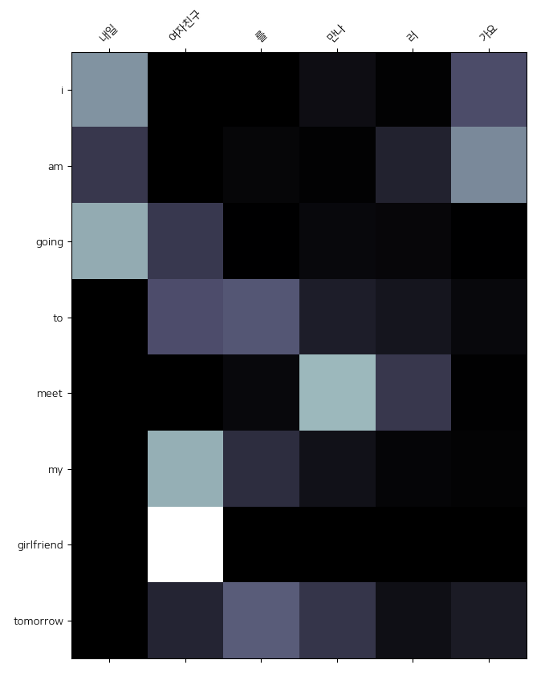
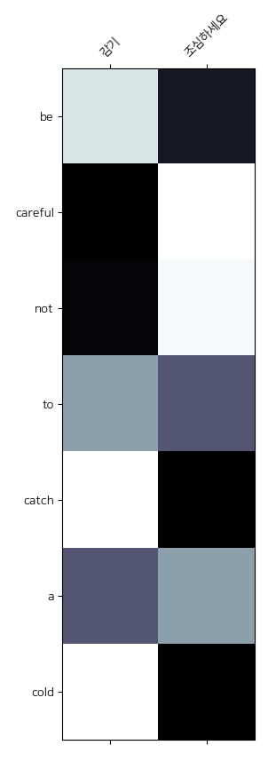

## Transformer PyTorch implementation
This repository contains [**Transformer**](https://papers.nips.cc/paper/7181-attention-is-all-you-need.pdf) implementation used to **translate Korean sentence into English sentence**.

I used translation dataset for NMT, but you can apply this model to any sequence to sequence (i.e. text generation) tasks such as text summarization, response generation, ..., etc.

In this project, I specially used Korean-English translation corpus from [**AI Hub**](http://www.aihub.or.kr/) to apply torchtext into Korean dataset. 

And I also used [**soynlp**](https://github.com/lovit/soynlp) library which is used to tokenize Korean sentence. 
It is really nice and easy to use, you should try if you plan to handle Korean sentences :)

Currently, the lowest valid and test losses are **2.047** and **3.488** respectively.

<br/>

### Overview
- Number of train data: 92,000
- Number of validation data: 11,500
- Number of test data: 11,500
```
Example: 
{
  'kor': '['부러진', '날개로', '다시한번', '날개짓을', '하라']',
  'eng': '['wings', 'once', 'again', 'with', 'broken', 'wings']'
}
```
<br/>

### Requirements

- Following libraries are fundamental to this repository.
- You should install PyTorch via official [Installation guide](https://pytorch.org/get-started/locally/).
- To use spaCy model which is used to tokenize english sentence, download English model by running `python -m spacy download en_core_web_sm`.

```
en-core-web-sm==2.1.0
matplotlib==3.1.1
numpy==1.16.4
pandas==0.25.1
scikit-learn==0.21.3
soynlp==0.0.493
spacy==2.1.8
torch==1.2.0
torchtext==0.4.0
```
<br/>


### Usage
- Before training the model, you should train `soynlp tokenizer` on your training dataset and build vocabulary using following code. 
- You can determine the size of vocabulary of Korean and English dataset. 
- In general, Korean dataset creates the larger size vocabulary than English dataset. Therefore to make balance, you have to choose **proper** vocab size
- By running following code, you will get `tokenizer.pickle`, `kor.pickle` and `eng.pickle` which are used to train, 
test the model and predict user's input sentence.

```
python build_pickles.py --kor_vocab KOREAN_VOCAB_SIZE --eng_vocab ENGLISH_VOCAB_SIZE
```
```
# in default vocab size
python build_pickles.py
```

- For training, run `main.py` with train mode (which is default option)

```
python main.py
```

- For testing, run `main.py` with test mode

```
python main.py --mode test
```

- For predicting, run `predict.py` with your Korean input sentence. 
- *Don't forget to wrap your input with double quotation mark !*

```
python predict.py --input "YOUR_KOREAN_INPUT"
```

<br/>

### Example
<p align="center">
  
</p>

```
kor> 내일 여자친구를 만나러 가요
eng> I am going to meet my girlfriend tomorrow
```

<p align="center">
  
</p>

```
kor> 감기 조심하세요
eng> Be careful not to catch a cold
```
<br/>

### To do
- Add **Beam Search** for decoding step
- Add **Label Smoothing** technique [#1](https://github.com/jadore801120/attention-is-all-you-need-pytorch/blob/master/train.py#L33), [#2](https://github.com/tunz/transformer-pytorch/blob/master/utils/utils.py#L8), [#3](https://3months.tistory.com/465)
<br/>

### References

Basically, most of my codes are based on [original paper](https://arxiv.org/abs/1706.03762). But, I found that there is a difference between original paper and practical implementation in tensor2tensor framework. Then, I fixed some codes to follow practical framework and got better result. For following these change, you should check-out the last [reference article](https://tunz.kr/post/4?fbclid=IwAR3yBAYfq_yOBoAdY9si5yPZjX5wQwZQV0MKA5L_AZHjCgdZAb_HW1TrWbs).

- [Transformer Official Implementation](https://github.com/tensorflow/models/tree/master/official/transformer)
- [Jadore's PyTorch Implementation](https://github.com/jadore801120/attention-is-all-you-need-pytorch)
- [Ben Trevett's Implementation](https://github.com/bentrevett/pytorch-seq2seq/blob/master/6%20-%20Attention%20is%20All%20You%20Need.ipynb)
- [Transformer Details Not Described in The Paper](https://tunz.kr/post/4?fbclid=IwAR3yBAYfq_yOBoAdY9si5yPZjX5wQwZQV0MKA5L_AZHjCgdZAb_HW1TrWbs)
